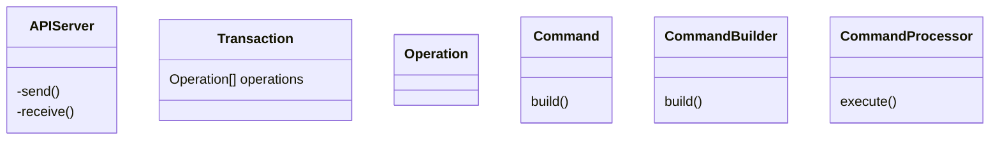
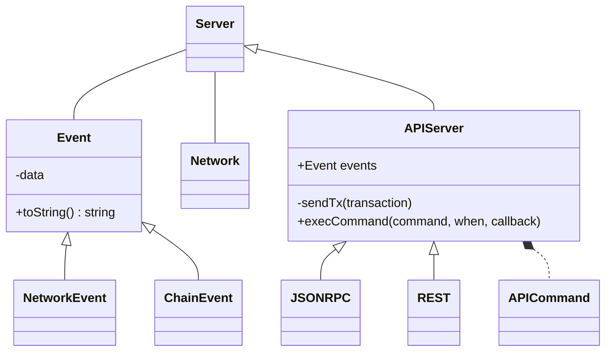

# SorobanIDE
SorobanIDE: Visual Studio Code extension

# Draft: Architecture
## Domain

## Interactions

**Server** belongs to a **Network** and emits **Events**.

**APIServer** is a **Server**.

APIServer interface is business-oriented: getTokenBalance(), depositToken(), withdrawToken(), getNetworkStatus(), etc.
