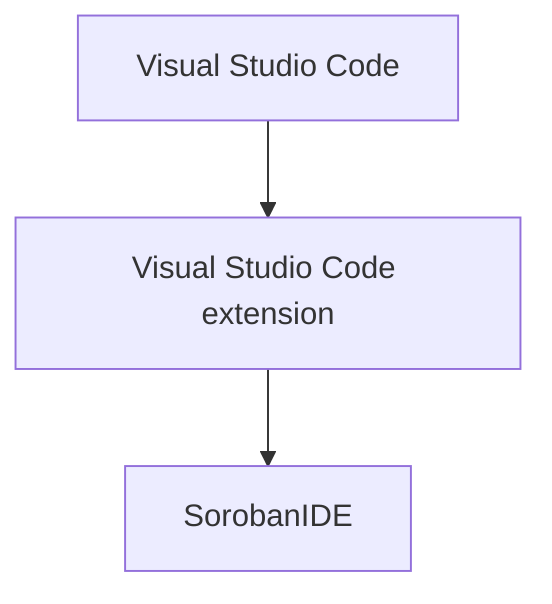

# SorobanIDE
SorobanIDE: Visual Studio Code extension

```mermaid
flowchart TD
    VSC["Visual Studio Code"]
    SorobanIDE["SorobanIDE"]
    VSCE["Visual Studio Code extension"]
    VSC --> VSCE --> SorobanIDE
```

